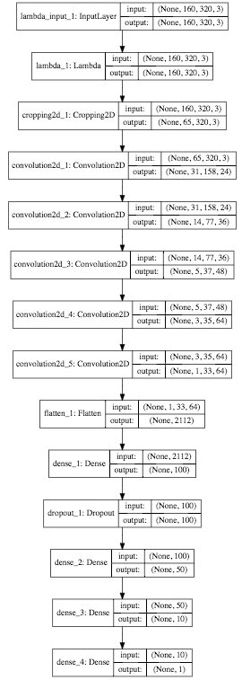

#**Behavioral Cloning**


## Goals for Behavioral Cloning Project

The goals / steps of this project are the following:
* Use the simulator to collect data of good driving behavior
* Build, a convolution neural network in Keras that predicts steering angles from images
* Train and validate the model with a training and validation set
* Test that the model successfully drives around track one without leaving the road
* Summarize the results with a written report


## Rubric Points
Here I will consider the [rubric points](https://review.udacity.com/#!/rubrics/432/view) individually and describe how I addressed each point in my implementation.

---
### Files Submitted & Code Quality

#### 1. Submission includes all required files and can be used to run the simulator in autonomous mode

My project includes the following files:
* model.ipynb containing the script to create and train the model
* drive.py for driving the car in autonomous mode
* model.h5 containing a trained convolution neural network
* README.md summarizing the results

#### 2. Submission includes functional code
Using the Udacity provided simulator and my ```drive.py``` file, the car can be driven autonomously around the track by executing.

However, I found that during track2, the steering_angle value calculated by this model were usually too small to keep the car on the road. Besides, I also found that if the throttle value is above 1, the car would seem to be not moving.

So I just changed the official ```drive.py``` code like this:

```python
steering_angle = float(model.predict(image_array[None, :, :, :], batch_size=1))*1.5

throttle = controller.update(float(speed))
if throttle > 0.9:
    throttle = 0.9

```


```sh
python drive.py model.h5
```

#### 3. Submission code is usable and readable

The ```model.ipynb``` file contains the code for training and saving the convolution neural network. The file shows the pipeline I used for training and validating the model, and it contains comments to explain how the code works.

### Model Architecture and Training Strategy

#### 1. An appropriate model architecture has been employed

My model consists of a convolution neural network， which was described in model.ipynb, code block 5.



The model includes RELU layers to introduce nonlinearity (code line 20), and the data is normalized in the model using a Keras lambda layer and cropped layer.


#### 2. Attempts to reduce overfitting in the model

At the very beginning, I found the model was well trained to pass both tracks, but as an attempt to reduce overfitting, a dropout layer were added after the first dense layer. Only 95% parameters were used for the next dense layer. Furthermore, the model was trained and validated on different data sets to ensure that the model was not overfitting. The model were trained for 40 Epoches  and the model with the lowest val_loss value were selected as the final model and was then tested by running it through the simulator and ensuring that the vehicle could stay on the track.

#### 3. Model parameter tuning

The model used an adam optimizer, so the learning rate was not tuned manually (model.py line 25).

#### 4. Appropriate training data

Training data was chosen to keep the vehicle driving on the road. As there were only center camera in testing process on the simulator, only the center camera data were used. I selected 64 samples in a validation dataset for plotting, with color bar blue for left, red for left and white for go straight, shown like this:


#### 5. Training strategy

I just used the training set provided by Udacity for training, and I almost passed track1, but failed in a sudden turn. So I just collected some pictures on this turn for around 3 more times and retraining the model with these additional data, which made me pass the track1.

Then I just used this model to test track2, and just failed. So I just run track2 for 2 rounds. If I came into some trouble in some sudden turns, I just collected my behavior on these turns.

As there are so many sudden turns on track2, I found that the ```steering_angle``` predicted by the model used to be not sufficient enought for turn left/right. So I just increased this value 1.5 times higher and I succeed in turning these sudden turns.

Finally, I just found that in my track2 trials, the car would stop in some place on the road even I restricted the throttle below 0.9. I re-run the test and finally the car finished its track2 challenge. I think it would be solved only if Udacity could provide more information for this speed control system.

#### 6. Results:


